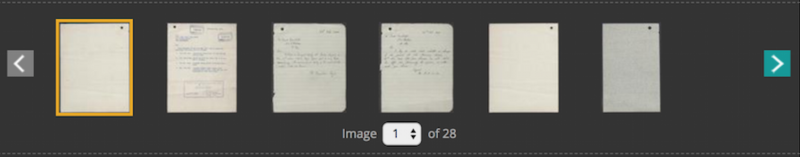

# Google Tag Manager scripts for all tna applications

## Development setup

This repository uses:

- Webpack for module bundling
- ESLint for linting the source JavaScript files
- Babel for transpiling of ES6 to ES5
- JS minification
- Jest for testing

Firstly, run '**npm install**' from the directory root in the terminal to install the required packages.

Having installed the Webpack CLI, run '**npm start**' to run ESLint, Babel, Uglify, and Watch in response to any changes in the test or source Javascript files.

To run unit tests, run '**npm test**' in the terminal. This will run all test suites.

This repository also provides test pages (available through index.html) which are used for debugging; the GTM scripts can be run on these pages and the data layer can be consulted in the console to verify that the correct data is being collected.

To start running the `index.html` just run the command from the route folder `php -S localhost:9000`

#### Set up with Discovery.
Developers working on scripts, which would need to be loaded from the server side in discovery, should also take an extra step to add the script to the server side in the discovery application after the initial PR process is completed. The developer would then need to send another PR explaining the code has been implemented into the discovery application.

## Reader screens GTM container setup
*This the code only refers to reader screens website as the GTM id is different to the TNA one*
#### Set up within GTM
1. Create a new constant variable variable called Reader-gaProperty. 
* Variable type: constant, the value is the GA account number. //This will be given to you

2. Create a new variable where the variable type is Google Analytics Settings.
*	Variable name: ReadersGlobalSetting
*	The tracking ID is {{Reader-gaProperty}} //Name of your constant variable
*	Cookie Domain is auto
*	Expand More settings > Fields to Set
*	Add Field where field Name is anonymizeIp and value is true (lowercase). //This anonymizes the IP address.

3. Create new Tag:
*	Tag type: Universal Analytics
*	Track type: Page view
*	Google Analytics Settings: {{ReadersGlobalSetting}} //Name of your Google Analtyics settings variable
*	Trigger: All Pages

#### Install GTM into website

*Paste this code as high in the <head> of the page as possible:*

<!-- Google Tag Manager -->
```javascript
<script>(function(w,d,s,l,i){w[l]=w[l]||[];w[l].push({'gtm.start':
new Date().getTime(),event:'gtm.js'});var f=d.getElementsByTagName(s)[0],
j=d.createElement(s),dl=l!='dataLayer'?'&l='+l:'';j.async=true;j.src=
'https://www.googletagmanager.com/gtm.js?id='+i+dl;f.parentNode.insertBefore(j,f);
})(window,document,'script','dataLayer','GTM-T6W6SVS');</script>
```
<!-- End Google Tag Manager -->

*Additionally, paste this code immediately after the opening <body> tag:*
```HTML
<!-- Google Tag Manager (noscript) -->
<noscript><iframe src="https://www.googletagmanager.com/ns.html?id=GTM-T6W6SVS"
height="0" width="0" style="display:none;visibility:hidden"></iframe></noscript>
<!-- End Google Tag Manager (noscript) -->
 ```
 
 #### Preview the tag and check pages are firing and collecting relevant info.
 #### In GA check in realtime that the data is coming through

## Discovery server side

This script will be rendered on the server side and will push an object to the data layer, detailing whether a user is registered and/or subscribed.

### Location

This script is located on every page in Discovery.

### How to test/testing guidelines

This test page contains all the meta tags that are needed to build the object to be sent to the data layer: From the HTML [here](https://github.com/nationalarchives/tna-google-tag-manager-scripts/blob/develop/views/discoveryServerSide.html)

There are several scenarios which may cause the content attribute of the meta tags to change. For example, if a user is not signed in and is not a subscriber, the relevant meta tag content attributes will be set to 'Not signed-in' and 'Not subscribed' respectively. In this case, the following object will be built:
	
	‘ContentGroup’ : ‘View records of other archives’,
	‘customDimension1’ : ‘Division within WO’,
	‘customDimension2’ : ‘Not subscribed’,
	‘customDimension3’ : ‘Not signed-in’,
        ‘ecommerce’ : {
               ‘promoView’ : {
                    ‘promotions’ : [{
                         ‘id’ : ‘ivp’,
                         ‘name’ : ‘Image Viewer Watermarked’,
                         ‘creative’ : ‘Image Viewer’,
                         ‘position’ : ‘Below record description’
                    }],
               }
          }
	  
For the different scenarios, please refer to the 'Stages' located in discoveryServerSide.html. To test different stages, uncomment the stage that you want active and comment out the previously active stage (only 1 stage can be active at any given time).	  
	  
If an image is **not** watermarked, the ecommerce object is ommitted from the overall object and the following object will be sent to the data layer (this example assumes that Stage 1 is active):

	‘ContentGroup’ : ‘View records of other archives’,
	‘customDimension1’ : ‘Division within WO’,
	‘customDimension2’ : ‘Not subscribed’,
	‘customDimension3’ : ‘Not signed-in’


## Ecommerce tracking

This script will be rendered on the server side and will push an object to the data layer containing the products that a user has purchased e.g. digital records or record copies.

Ecommerce user journey: https://github.com/nationalarchives/tna-google-tag-manager-scripts/tree/feature/ecommerce_tracking/img/Discovery_payment_user_journey.png

The data to be extracted will be drawn from 'Step 4' of the user journey.

### Location

This script is located on the Discovery receipts page.

### How to test/testing guidelines

Once on the Discovery receipts page, the following meta tags should be available:

`<meta name="WT.si_n" content="Discovery store">`\
`<meta name="WT.si_n" content="Step 4">`\
`<meta name="WT.si_n" content="Digital Record">`\
`<meta name="WT.si_n" content="The National Archives">`\
`<meta name="WT.si_n" content="AIR 50/163/32">`\
`<meta name="WT.si_n" content="1">`\
`<meta name="WT.si_n" content="3.50">`\
`<meta name="WT.si_n" content="3.50">`\
`<meta name="WT.si_n" content="I/657715845504212R">`

Provided that the above tags are available, the following object will be built and pushed to the data layer where it can be used by Google Tag Manager:
	  
    ‘event’ : ‘checkoutOption’
          ‘ecommerce’ : {
               ‘actionField’ : {‘step: step 4, ‘option’ : Receipt}
               ‘purchase’ : {
                    ‘actionField’ : {
                         ‘id’ : ‘I/657715845504212R’,
                         ‘affiliation’ : ‘Discovery Store’,
                         ‘revenue’ : ‘3.50’,
                         ‘tax’ : ‘0.00’,
                         ‘shipping’ : ‘0.00’
                    },
                    ‘products’ : [{
                         ‘name’ : ‘AIR 50’,
                         ‘price’ : ‘3.50’,
                         ‘brand’ : ‘The National Archives’,
                         ‘category’ : ‘Digital Record’,
                         ‘variant’ : ‘AIR 50/163/32’,
                         ‘quantity’ : 1
                    }]
               }
          }


## Form Abandonment
This script is rendered inside Google Tag Manager ( GTM ) and is pushing an object to the data layer. It will run every time a user close the page with a form element inside which has a class attribute of `form-abandonment`.

### Location
Inside Google Tag Manager ( GTM )

### How to test/testing guidelines
Once on the contact form page, the following DOM elements structure should be available:

```html
<form action="" id="some_form_ID" class="form-abandonment" method="POST" novalidate="novalidate">
   <fieldset class="form-step-1">
        <legend>Legend</legend>
            <div class="form-row">
	 	<label for="certificate_name">Field name</label> 
	 	<input type="text" id="certificate_name" name="certificate-name" value="Mihai Diaconita" aria-required="true" required="" class="form-warning" aria-describedby="certificate_name-error">
		<span id="certificate_name-error" class="form-error form-hint">Please enter the certificate holder’s name(s)</span>
            </div> 
   </fieldset>
</form>
```
		
If the above Document Object Model (DOM) elements are available, the following object is built and pushed to the data layer.

```javascript
{
 'event': 'formAbandonment',
 'eventCategory': 'Form Abandonment',
 'eventAction': 'ID: certificate_name > Error: certificate_name-error'
}
```
  
## Home page
This script is rendered inside Google Tag Manager ( GTM ) and is pushing an object to the data layer containing the custom data attribute like e.g. `data-gtm-banner`, `data-gtm-id`, `data-gtm-position`, `data-gtm-creative`. It will run every time a user clicks on any cards on the home page.

### Location
Inside Google Tag Manager ( GTM )

### How to test/testing guidelines
Once on the Home page, the following DOM elements should be available:

```html
<div class="card hero-banner clearfix">
    <a id="hero-banner" href="https://example.co.uk"
       data-gtm-name="Title" 
       data-gtm-id="ID"
       data-gtm-position="Hero banner" 
       data-gtm-creative="Content type">
	<div class="entry-image"
	     style="background-image: url(https://img.evbuc.com/)">
	</div>
	<div class="hero-banner-entry">
	    <div class="entry-content event">
		<div class="content-type"> Content type </div>
		<h3> Title </h3>
		<p> Content </p>
	    </div>
	</div>
    </a>
</div>
```
		
If the above Document Object Model (DOM) elements are available, the following object is built and pushed to the data layer.

```javascript
{
  event: "Promotions",
  eventAction:"Title",
  eventCategory:"Content type",
  eventLabel: "Banner 1",
  gtm.uniqueEventId:"ID"
}
```

## Discovery imageviewer banner click 
This script is rendered inside Google Tag Manager ( GTM ) and is pushing an object to the data layer. It will run every time a user clicks on a banner going across the imageviewer.

<br />*Example*


### Location
Inside Google Tag Manager ( GTM )

### How to test/testing guidelines
Once on a details page in discovery outside the TNA network, the banner should appear over the image from the example above. Once banner appears click on the banner and verify the click from the GTM console.

```html
<div id="imageviewerOverlay">
    <p>To download this record without a watermark, please add it to your basket.</p>
</div>
```
		
If the above Document Object Model (DOM) elements are available, the following object is built only when clicked and pushed to the data layer.

```javascript
'event': 'promotionClick',
  'ecommerce': {
    'promoClick': {
        'promotions': [{
          'id': 'bts',
          'name': 'Image viewer banner',
          'creative': 'Banner',
          'position': 'On watermarked image'
        }]
    }
}
```

## Discovery imageviewer controller 
This script has been developed to push analytics data to GTM, which can provide stats on the click events occuring on the controllers within the image viewer.





### How to test/testing guidelines
Setting up the deveopment environment, would require to run a server in the root folder of the project `tna-google-tag-manager-script`. eg `php -S localhost:9000`.

### Location
[Link to the source file](https://github.com/nationalarchives/tna-google-tag-manager-scripts/blob/develop/src/imageViewer.js)

### Object data schema
```javascript
{
     'event': "Discovery image viewer"
     'eventAction': "Image viewer functions"
     'eventCategory': "Discovery"
     'eventLabel': "Zoom in"
}
```

## Filter tracking
This script is rendered inside Google Tag Manager ( GTM ) and is pushing an object to the data layer containing data regarding the search filters that a user has applied. It will run every time a user clicks on the 'refine' button which applies search filters.

### Location
Inside Google Tag Manager ( GTM )

### How to test/testing guidelines
Once on the search results page, the search filters should be available in the DOM. For example:

```html
<li id="subjects">
	<form action="/results/r" method="get"><input name="_q" type="hidden" value="*"><input name="_hb" type="hidden" value="tna">                    <h3><a href="#" class="filter-toggler expanded" id="subject-filters" role="tab">Subjects</a></h3>
		<div class="filter-togglee" aria-labelledby="subject-filters" role="tabpanel">
                	<ul>
                    		<li>
                        		<input type="checkbox" name="_tsj" value="C10065" id="C10065" />
                        		<label for="C10065">
                            			Armed Forces (General Administration)
                            			<span>(9,392,340)</span>
                        		</label>
                   		</li>
                    		<li>
                        		<input type="checkbox" name="_tsj" value="C10092" id="C10092" />
                        		<label for="C10092">
                            			Army
                            			<span>(6,530,838)</span>
                        		</label>
                    		</li>
                    		<li>
                        		<input type="checkbox" name="_tsj" value="C10075" id="C10075"/>
                        		<label for="C10075">
                           			Operations, battles and campaigns
                            			<span>(6,248,824)</span>
                        		</label>
                    		</li>
                	</ul>
			<input name="Refine subjects" value="Refine" type="submit" title="Refine subjects">
            	</div>
	</form>
</li>
```
		
If the above Document Object Model (DOM) elements are available, the following object is built and pushed to the data layer.

```javascript
{
  event: "Discovery",
  eventAction:"Discovery",
  eventCategory:"Refine subjects",
  eventLabel: "Armed Forces (General Administration),Army,Operations, battles and campaigns"
}
```

## Registration tracking
This script is rendered inside Google Tag Manager ( GTM ) and is pushing an object to the data layer containing data regarding the registration process and whether the registration form fields have been filled in. It will run on every submit or whenever form errors occur.

### Location
Inside Google Tag Manager ( GTM )

### How to test/testing guidelines
Once on the registration page, the registration form should be available in the DOM (countries have been removed from ```<select id="Country">``` for conciseness). For example:

```html
<div class="breather register">

                <form action="/Login/register" class="cmxform" id="regForm" method="post">
                    <fieldset>
                        <legend><span><span>Registration form</span></span></legend>
                        <p>
                            Fill in the form below to register an account. All fields are mandatory except those marked
                            as optional.
                            Already registered?
                            <a href="/Login/sign-in?wa=wsignin1.0">Sign in</a>.
                        </p>

                        <div class="grid-within-grid-two-item">
                            <div>

                                <div class="field-row clr">
                                    <label for="Name">Name<span>(optional)</span></label>
                                    <input id="Name" name="Name" type="text" value=""/>
                                </div>

                                <div class="field-row clr">
                                    <label for="Email">Email</label>
                                    <input autocomplete="off" data-val="true"
                                           data-val-email="Email is not a valid email format."
                                           data-val-required="The Email field is required." id="Email" name="Email"
                                           oncopy="return false" onpaste="return false" type="text" value=""/>
                                </div>
                                <span class="field-validation-valid" data-valmsg-for="Email"
                                      data-valmsg-replace="true"></span>
                                <div class="field-row clr">
                                    <label for="ConfirmEmail">Confirm email</label>
                                    <input autocomplete="off" data-val="true"
                                           data-val-email="ConfirmEmail is not a valid email format."
                                           data-val-equalto="The email address and confirmation email address do not match."
                                           data-val-equalto-other="*.Email"
                                           data-val-required="The ConfirmEmail field is required." id="ConfirmEmail"
                                           name="ConfirmEmail" oncopy="return false" onpaste="return false" type="text"
                                           value=""/>
                                </div>
                                <span class="field-validation-valid" data-valmsg-for="ConfirmEmail"
                                      data-valmsg-replace="true"></span>
                                <div class="field-row clr">
                                    <label for="Country">Country<span>(optional)</span></label>
                                    <select id="Country" name="Country">
                                        <option></option>
                                        <option>United Kingdom</option>
                                    </select>

                                </div>
                                <span class="field-validation-valid" data-valmsg-for="Country"
                                      data-valmsg-replace="true"></span>
                                <div class="toolTip">
                                    <div>
                                        <strong>Password rules: </strong>Password needs to be at least 8 characters long
                                        and should be a combination of upper and lowercase characters, with at least one
                                        numerical value.
                                    </div>
                                </div>
                                <div class="field-row clr">
                                    <label for="Password">Password</label>
                                    <input data-val="true"
                                           data-val-password="Password must be at least 8 characters long and should be a combination of upper and lowercase characters, with at least one numerical value."
                                           data-val-required="The Password field is required." id="Password"
                                           name="Password" type="password"/>
                                </div>
                                <span class="field-validation-valid" data-valmsg-for="Password"
                                      data-valmsg-replace="true"></span>
                                <div class="field-row clr">
                                    <label for="ConfirmPassword">Confirm password</label>
                                    <input data-val="true"
                                           data-val-equalto="The password and confirmation password do not match."
                                           data-val-equalto-other="*.Password"
                                           data-val-required="The ConfirmPassword field is required."
                                           id="ConfirmPassword" name="ConfirmPassword" type="password"/>
                                </div>
                                <span class="field-validation-valid" data-valmsg-for="ConfirmPassword"
                                      data-valmsg-replace="true"></span>
                            </div>
                            <div>
                                <div class="field-row clr">
                                    <label for="ReaderTicket">Reader's ticket number<span>(optional)</span></label>
                                    <input data-val="true" data-val-number="The field ReaderTicket must be a number."
                                           id="ReaderTicket" name="ReaderTicket" type="text" value=""/>
                                    <span class="field-validation-valid" data-valmsg-for="ReaderTicket"
                                          data-valmsg-replace="true"></span>
                                </div>

                                <div class="field-row clr">
                                    <label for="acceptTCs" id="tcLabel" class="checkInputLabel">
                                        I accept the <a href="http://www.nationalarchives.gov.uk/legal/privacy.htm"
                                                        target="_blank">Privacy</a> and <a
                                            href="http://nationalarchives.gov.uk/legal/cookies.htm" target="_blank">Cookie</a>
                                        policies.
                                    </label>
                                    <input data-val="true" data-val-required="You must accept the terms and conditions."
                                           id="acceptTCs" name="TermNCondition" type="checkbox" value="true"/><input
                                        name="TermNCondition" type="hidden" value="false"/>
                                </div>
                                <span class="field-validation-valid" data-valmsg-for="TermNCondition"
                                      data-valmsg-replace="true"></span>
                                <div class="field-row clr">
                                    <input data-val="true" data-val-required="The MailingCondition field is required."
                                           id="MailingCondition" name="MailingCondition" type="checkbox"
                                           value="true"/><input name="MailingCondition" type="hidden" value="false"/>
                                    <label for="MailingCondition" id="mlLabel" class="checkInputLabel">
                                        I want to join the mailing list, and be the first to hear about news, events,
                                        services and publications from The National Archives.
                                        <span>(optional)</span>
                                    </label>
                                </div>
                                <div class="field-row clr">
                                    <input data-val="true" data-val-required="The ContactCondition field is required."
                                           id="ContactCondition" name="ContactCondition" type="checkbox"
                                           value="true"/><input name="ContactCondition" type="hidden" value="false"/>
                                    <label for="ContactCondition" id="frLabel" class="checkInputLabel">
                                        I would like to take part in market research for The National Archives.<span>(optional)</span>
                                    </label>

                                </div>
                                <div class="field-row clr">
                                    <input class="submit discoveryPrimaryCallToActionLink" type="submit"
                                           value="Register">

                                    <input id="wreply" name="wreply" type="hidden" value=""/>
                                    <input id="wtrealm" name="wtrealm" type="hidden" value=""/>
                                </div>
                            </div>
                        </div> <!-- end of .grid-within-grid-two-item -->
                        <div class="emphasisBlock no-bg-color"><h2>Data protection</h2>When you sign up to our mailing
                            list the information that you provide will be used to send you our monthly newsletter and
                            other information that we have not included in the newsletter but think may be of interest
                            to you. We use an email distribution company to send out our e-marketing communications but
                            your data will not be passed on to any other third parties. You can remove your details from
                            our mailing database at any time by following the link at the bottom of every email that we
                            send you. For more information read our <a
                                    href="http://www.nationalarchives.gov.uk/legal/privacy.htm">Privacy policy</a>.
                        </div>
                    </fieldset>
                </form>
            </div>
```
		
If the above Document Object Model (DOM) elements are available and the registration form is successfully completed, the following object is built and pushed to the data layer (indicating whether the form fields have been filled in):

```javascript
{
  eventAction:"Account registration",
  eventCategory:"Registration submits",
  eventLabel: "Name: Yes > Email: Yes > ConfirmEmail: No > Password: No etc..."
}
```

If errors have occurred in the form (e.g. required fields were not filled in), the following object is built and pushed to the data layer:

```javascript
{
  eventAction:"Account registration",
  eventCategory:"Registration errors",
  eventLabel: "ConfirmEmail: The email address and confirmation email address do not match. > Password: The Password field is required. etc..."
}
```
